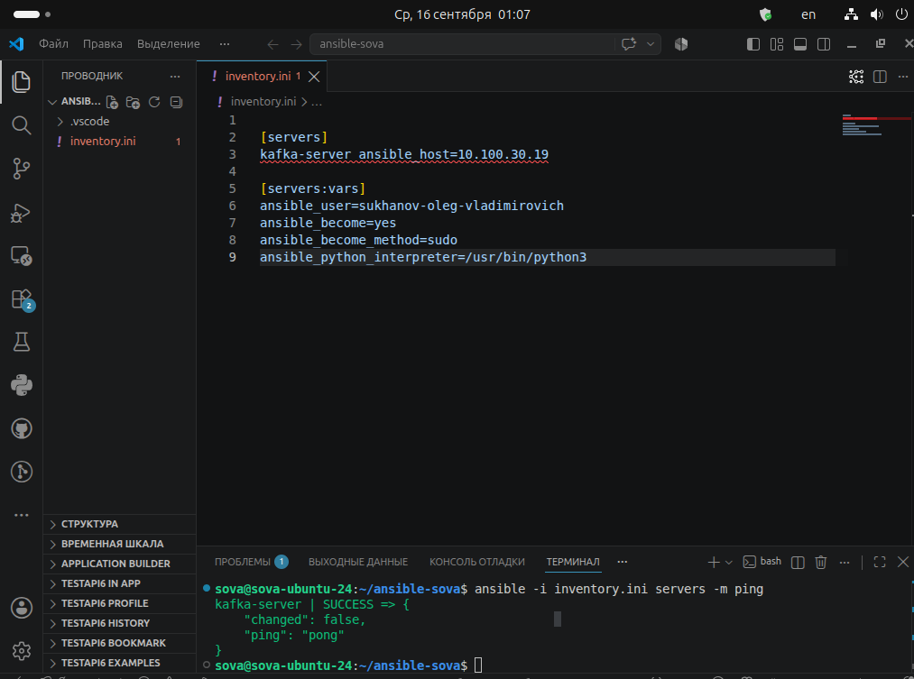
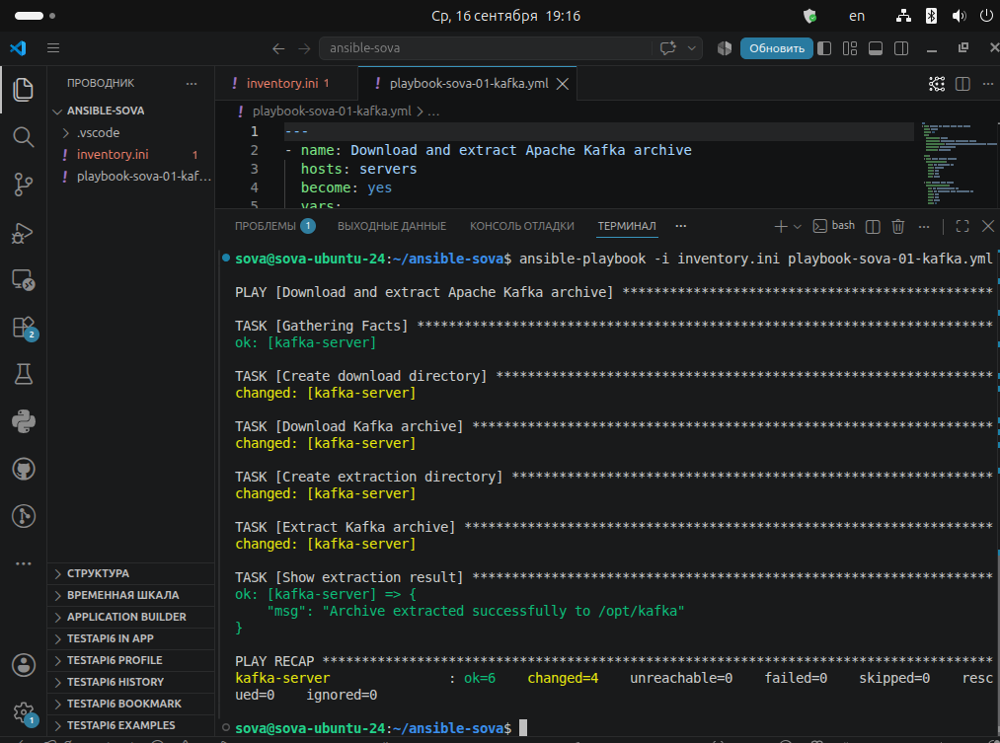
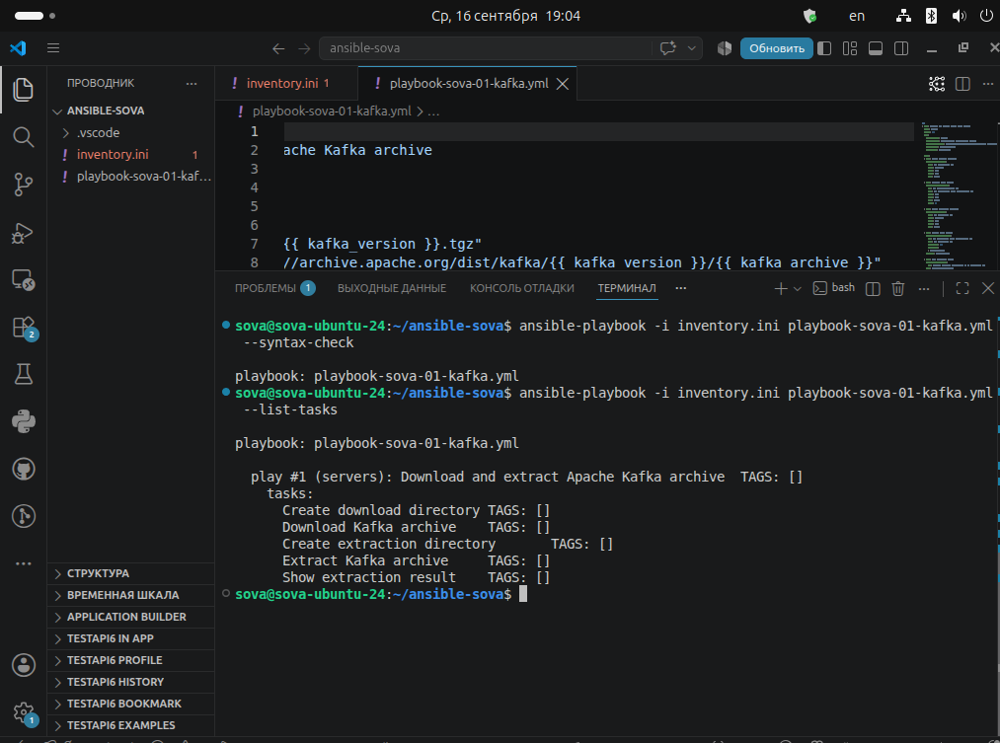
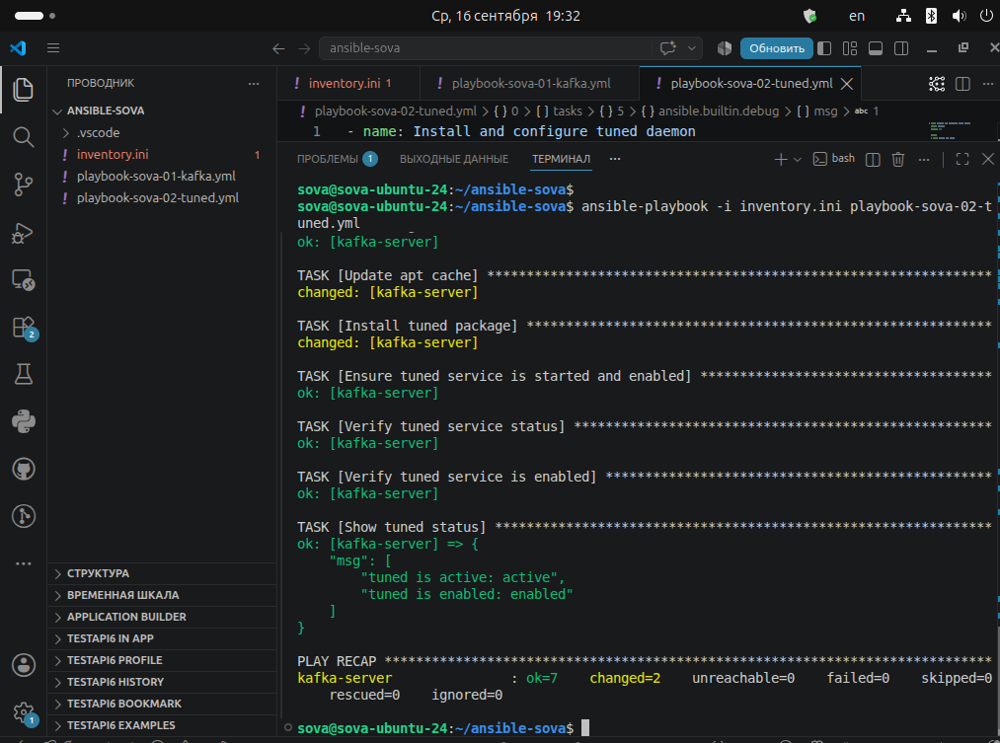
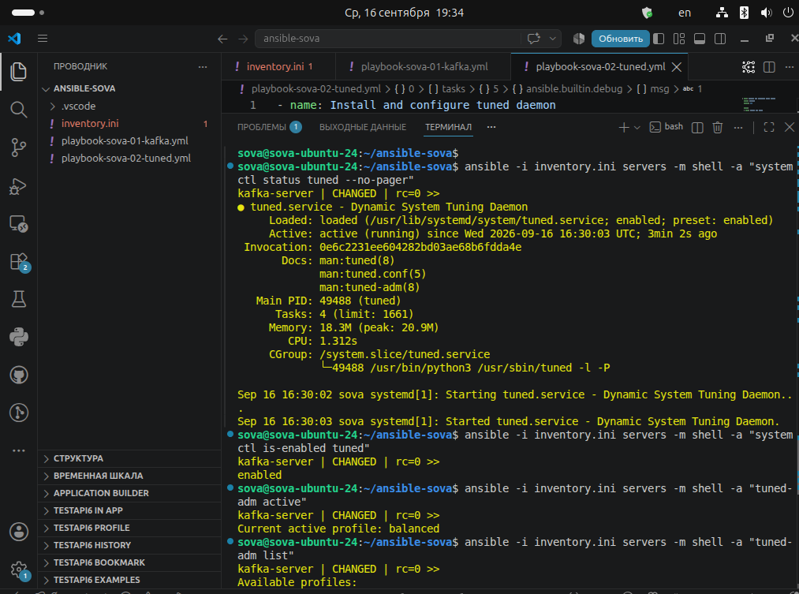
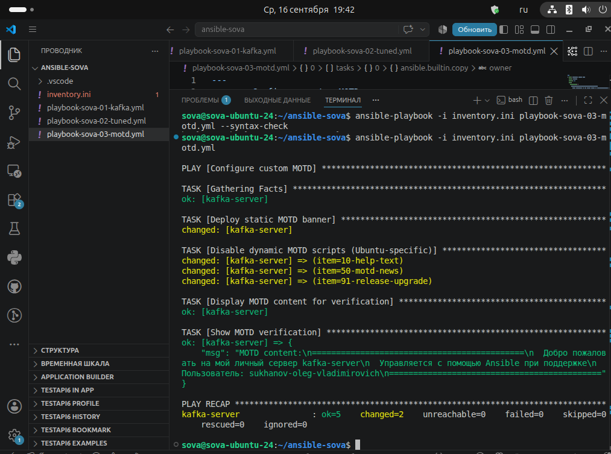
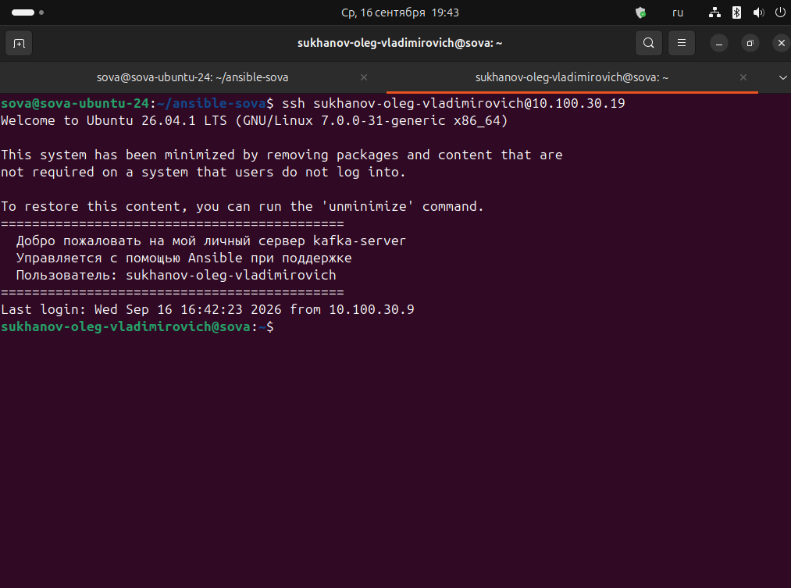

# Ansible-2: три плейбука для управления сервером

**Выполнил:** Суханов Олег
---

## Задание 1. Скачивание архива, создание папки и распаковка

**Файл inventory.ini**
Создаем файл прописываем параметры подключения, в моем случае это ssh на удаленной машине, копируем ключи ssh, проверяем подключение.

**Код inventory.ini**

[servers]
kafka-server ansible_host=10.100.30.19

[servers:vars]
ansible_user=sukhanov-oleg-vladimirovich
ansible_become=yes
ansible_become_method=sudo
ansible_python_interpreter=/usr/bin/python3

**Результат подключения:**




**Плейбук:** `playbook-sova-01-kafka.yml`

**Код плейбука:**

```yaml
- name: Download and extract Apache Kafka archive
  hosts: servers
  become: yes
  vars:
    kafka_version: "3.7.0"
    kafka_archive: "kafka_2.13-{{ kafka_version }}.tgz"
    kafka_download_url: "https://archive.apache.org/dist/kafka/{{ kafka_version }}/{{ kafka_archive }}"
    download_dir: "/opt/downloads"
    extract_dir: "/opt/kafka"

  tasks:
  - name: Create download directory
    ansible.builtin.file:
      path: "{{ download_dir }}"
      state: directory
      owner: root
      group: root
      mode: '0755'

  - name: Download Kafka archive
    ansible.builtin.get_url:
      url: "{{ kafka_download_url }}"
      dest: "{{ download_dir }}/{{ kafka_archive }}"
      owner: root
      group: root
      mode: '0644'
      force: no

  - name: Create extraction directory
    ansible.builtin.file:
      path: "{{ extract_dir }}"
      state: directory
      owner: root
      group: root
      mode: '0755'

  - name: Extract Kafka archive
    ansible.builtin.unarchive:
      src: "{{ download_dir }}/{{ kafka_archive }}"
      dest: "{{ extract_dir }}"
      remote_src: yes
      extra_opts:
      - --no-same-owner
    register: extract_result

  - name: Show extraction result
    ansible.builtin.debug:
      msg: "Archive extracted successfully to {{ extract_dir }}"
    when: extract_result.changed
```

**Описание:** Плейбук скачивает архив Apache Kafka, создаёт директорию для распаковки и извлекает архив.

**Результат выполнения:**



**Результат выполнения:**




---

## Задание 2. Установка tuned

**Плейбук:** `playbook-sova-02-tuned.yml`

**Код плейбука:**

```yaml
---
- name: Install and configure tuned daemon
  hosts: servers
  become: yes

  tasks:
  - name: Update apt cache
    ansible.builtin.apt:
      update_cache: yes
      cache_valid_time: 3600

  - name: Install tuned package
    ansible.builtin.apt:
      name: tuned
      state: present

  - name: Ensure tuned service is started and enabled
    ansible.builtin.systemd_service:
      name: tuned
      state: started
      enabled: yes
      daemon_reload: yes

  - name: Verify tuned service status
    ansible.builtin.command:
      cmd: systemctl is-active tuned
    register: tuned_status
    changed_when: false
    failed_when: tuned_status.rc != 0

  - name: Verify tuned service is enabled
    ansible.builtin.command:
      cmd: systemctl is-enabled tuned
    register: tuned_enabled
    changed_when: false
    failed_when: tuned_enabled.stdout != "enabled"

  - name: Show tuned status
    ansible.builtin.debug:
      msg:
      - "tuned is active: {{ tuned_status.stdout }}"
      - "tuned is enabled: {{ tuned_enabled.stdout }}"
```

**Результат:**



**Проверка демона:**



---

## Задание 3. Изменение MOTD

**Плейбук:** `playbook-sova-03-motd.yml`

**Код плейбука:**

```yaml
---
- name: Configure custom MOTD
  hosts: servers
  become: yes
  vars:
    custom_motd: |
      ============================================
        Добро пожаловать на мой личный сервер {{ inventory_hostname }}
        Управляется с помощью Ansible при поддержке
        Пользователь: {{ ansible_user }}
      ============================================

  tasks:
  - name: Deploy static MOTD banner
    ansible.builtin.copy:
      content: "{{ custom_motd }}"
      dest: /etc/motd
      owner: root
      group: root
      mode: '0644'

  - name: Disable dynamic MOTD scripts (Ubuntu-specific)
    ansible.builtin.file:
      path: "/etc/update-motd.d/{{ item }}"
      mode: '0644'
    loop:
    - 00-header
    - 10-help-text
    - 50-motd-news
    - 85-fwupd
    - 88-esm-announce
    - 90-updates-available
    - 91-contract-ua-esm-status
    - 91-release-upgrade
    - 92-unattended-upgrades
    - 95-hwe-eol
    - 98-fsck-at-reboot
    - 98-reboot-required
    failed_when: false

  - name: Display MOTD content for verification
    ansible.builtin.command:
      cmd: cat /etc/motd
    register: motd_content
    changed_when: false

  - name: Show MOTD verification
    ansible.builtin.debug:
      msg: "MOTD content:

        {{ motd_content.stdout }}"

```

**Результат:**



**Результат при SSH-входе:**



---

## Структура репозитория

- `inventory.ini` — инвентарь Ansible
- `playbook-sova-01-kafka.yml` — плейбук для Kafka
- `playbook-sova-02-tuned.yml` — плейбук для tuned
- `playbook-sova-03-motd.yml` — плейбук для MOTD
- `images/` — скриншоты результатов
